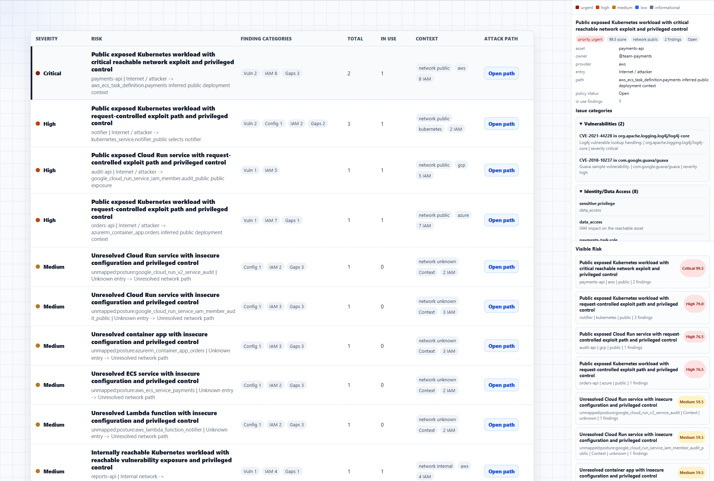
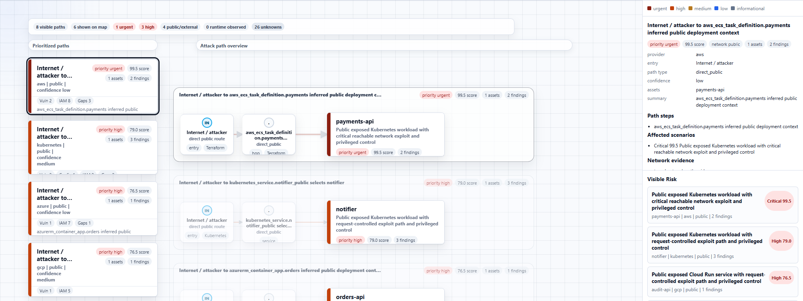

# Reachability Advisor

Local-first attack-path prioritization for dependency, SAST, DAST, and CSPM findings.

Reachability Advisor is a CI and IDE correlation layer for security scanner output. It answers one practical question:

> Which findings are connected to reachable code, deployed assets, network exposure, identity access, and business impact?

It does not replace scanners. It consumes their evidence, connects it to deployment context, and ranks findings without treating missing evidence as safe.

## Preview





## What It Does

- Ingests SBOM/SCA vulnerability data, source reachability evidence, SAST, DAST, CSPM/posture evidence, Terraform plans, Kubernetes manifests, and artifact identity manifests.
- Builds an evidence graph across assets, network paths, identities, source/runtime evidence, packages, and findings.
- Uses graph-first scoring to separate confirmed risk, potential risk, blockers, unknowns, and visibility gaps.
- Emits CI and developer outputs: JSON, SARIF, Markdown, IDE diagnostics, PR deltas, readiness reports, and an interactive HTML attack-path report with per-finding evidence stories.
- Stays local-first: no live cloud calls, telemetry, auto-suppression, or automatic "not affected" conclusions.

## Quick Demo

Run a complete no-cloud demo from checked-in samples:

```bash
python -m reachability_advisor demo
```

Key outputs:

- `outputs/demo/summary.md` - prioritized findings and visibility gaps.
- `outputs/demo/findings.json` - machine-readable findings with evidence and graph decisions.
- `outputs/demo/reachability-graph.html` - interactive attack-path report with path cards, evidence graph, and finding details.

See [Quickstart](docs/quickstart.md) for install steps, sample scans, release gates, and common workflow commands.

## Common Workflows

- **Dependency prioritization:** combine SBOM and Grype/OSV/local vulnerability data.
- **AppSec triage:** correlate SAST and DAST findings with source, routes, artifacts, and runtime evidence.
- **Deployment-aware risk:** add Terraform plan, rendered Kubernetes evidence, and CSPM scanner output to account for network exposure, IAM, workload identity, and cloud posture.
- **CI release gate:** fail on confirmed or high-potential paths while reporting unknowns as visibility gaps.
- **Developer feedback:** export SARIF and IDE diagnostics only where real source locations exist.

## Evidence Model

Reachability Advisor keeps evidence types separate:

- Dependency vulnerabilities are package and vulnerability records.
- Static code weaknesses come from SAST/source evidence.
- Dynamic runtime observations come from DAST/runtime evidence.
- Cloud posture findings come from CSPM scanner output or native checks over local Terraform/Kubernetes evidence.
- Correlations link findings without merging or suppressing originals.

Details: [Evidence model](docs/evidence_model.md), [Scoring](docs/scoring.md), [Input adapters](docs/input_adapters.md).

## Main Outputs

- Prioritized findings JSON
- Markdown summary
- SARIF
- IDE diagnostics JSON
- Interactive HTML attack-path report: Attack Paths, Architecture, Evidence Paths, and Findings views
- Mapping, coverage, readiness, and baseline delta reports

## Safety Boundary

Reachability Advisor is intentionally conservative. It does not make live cloud API calls, scan secrets, scan malware, create tickets, build a CNAPP inventory, suppress findings automatically, or claim exploitability from weak evidence. Missing evidence remains unknown.

## Documentation

- [Documentation index](docs/README.md) - complete map of user, operator, design, and maintainer docs.
- [Quickstart](docs/quickstart.md) - install, demo, sample scan, release gate, PR delta, and fixture commands.
- [Input adapters](docs/input_adapters.md) - scanner and context inputs accepted by the CLI.
- [Evidence model](docs/evidence_model.md) and [scoring model](docs/scoring.md) - how evidence becomes prioritized findings.
- [Pipeline integration](docs/pipeline.md) - CI, GitHub Actions, baselines, release gates, and generated artifacts.
- [User-facing messages](docs/user_facing_messages.md) - wording rules for CLI errors, readiness blockers, reports, and web labels.
- [Roadmap](docs/roadmap.md) - stabilization priorities and release-readiness acceptance criteria.
- [Production readiness review](docs/production_readiness.md) - feature grades and next stabilization focus.

## Quality Snapshot

The repository includes unit, fixture, scale, coverage, release-check, package, demo, SARIF, Markdown, JSON, diagnostics, and HTML output tests. The full local gate is documented in [Quickstart](docs/quickstart.md).
